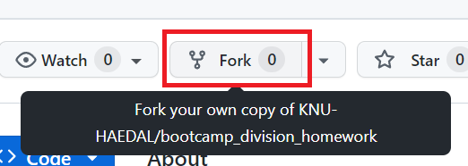
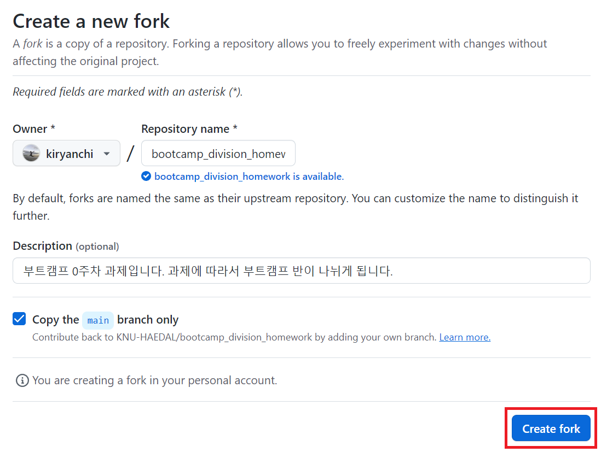
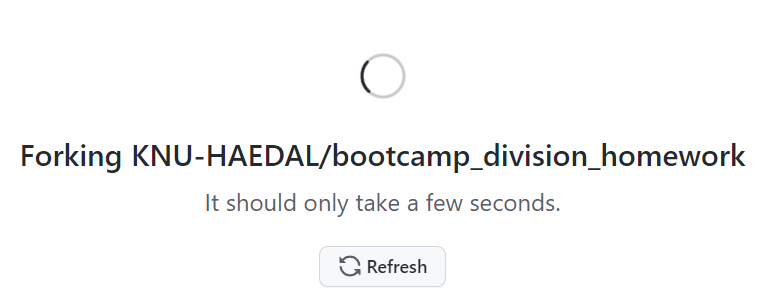
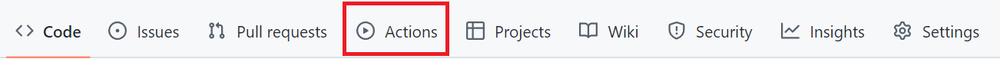
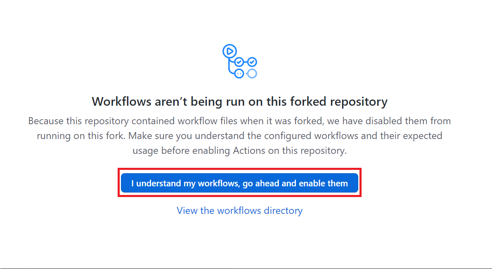
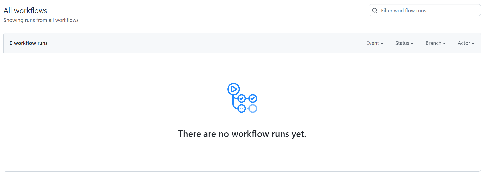

# 해달 0주차 과제 가이드

본격적으로 과제를 시작하기 전, github repository를 fork떠서 본인의 github에 repository를 생성해야 합니다. 다음 과정을 그대로 따라하면 생성할 수 있습니다.

## 🧱 문제를 풀다가 막혔을 때

문제를 풀다보면 어디서부터 손을 대야할지, 무엇을 모르는 지 몰라서 검색을 못 할 때가 있습니다.

그럴 땐 얼마든지 **동아리방**이나 **디스코드**에서 편하게 질문하세요!

1. `Fork` 버튼을 클릭합니다.

    

1. `Create fork` 버튼을 클릭합니다.

    

1. 아래 화면이 나오면 fork 중이니 대기합니다.

    

1. `Actions` 탭을 클릭 한 뒤, `I understand my workflows, go ahead and enable them` 버튼을 클릭합니다.

    

    

1. 아래 화면이 나오면 성공입니다!

    