# 해달 0주차 과제 가이드

과제를 진행하면서 다양한 준비물이 필요합니다. 필요한 준비물은 다음과 같습니다.

## 🧱 문제를 풀다가 막혔을 때

문제를 풀다보면 어디서부터 손을 대야할지, 무엇을 모르는 지 몰라서 검색을 못 할 때가 있습니다.

그럴 땐 얼마든지 **동아리방**이나 **디스코드**에서 편하게 질문하세요!

## 💻 준비물

- [Visual Studio Code](https://code.visualstudio.com/)
- [Git](https://git-scm.com/)
- (C를 선택할 경우) [MinGW](https://sourceforge.net/projects/mingw/) / (macOS인 경우) 터미널에서 `xcode-select --install` 실행
- (Python을 선택할 경우) [Python](https://www.python.org/)

## 목차

1. [1-A GCC](#1-a-gcc)
1. [1-B Python](#1-b-python)
1. [2. Git](#2-git)
1. [3. Visual Studio Code](#3-visual-studio-code)

## 1-A. [GCC](https://sourceforge.net/projects/mingw/)

> [!IMPORTANT]
>
> C 언어로 문제를 풀 경우, 아래 과정을 따라하시면 됩니다.
>
> Python으로 문제를 푸실 분은 [여기](#1-b-python)를 누르시면 됩니다.

### 🪟 Windows인 경우

1. [MinGW](https://sourceforge.net/projects/mingw/) 사이트 접속 후 `Download` 버튼을 클릭합니다.

    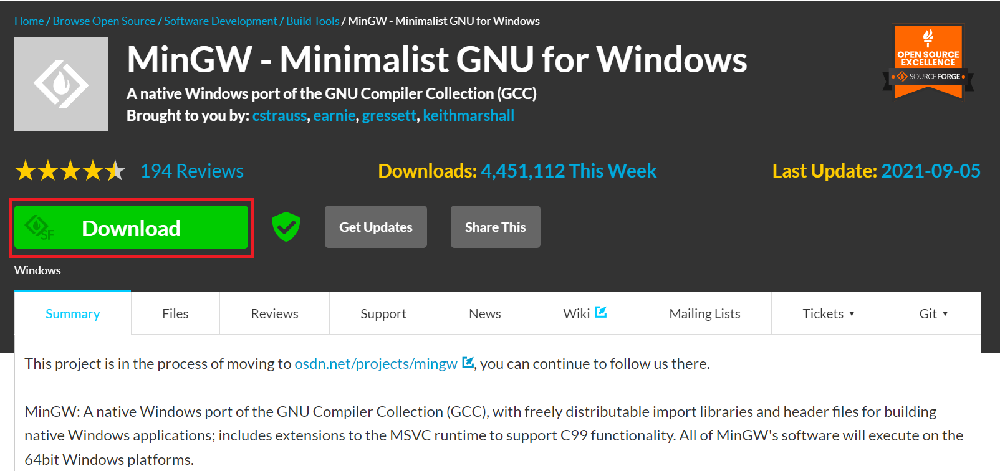

1. `Install` - `Continue` 버튼을 클릭합니다.

    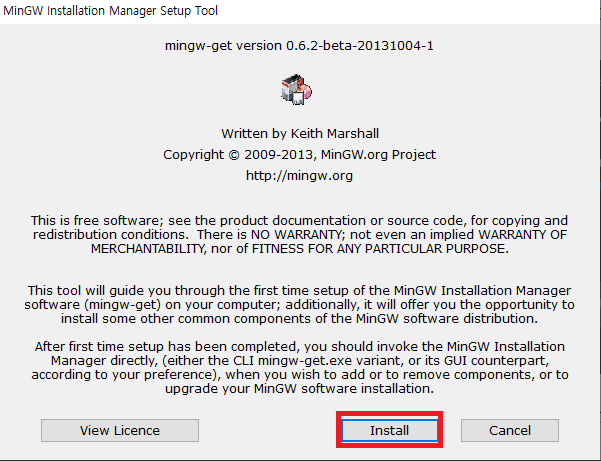

    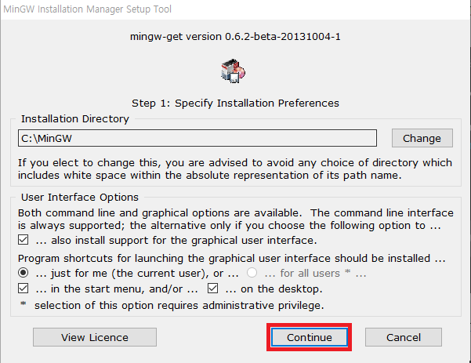

    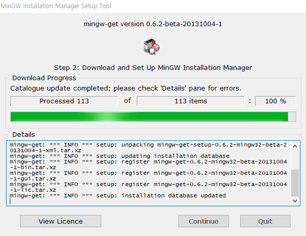

1. MinGW 설치가 끝나면 아래와 같이 체크한 뒤 `Installation` - `Apply Changes` 를 클릭합니다.

    - mingw-developer-toolkit
    - mingw32-base
    - mingw32-gcc-g++
    - msys-base

    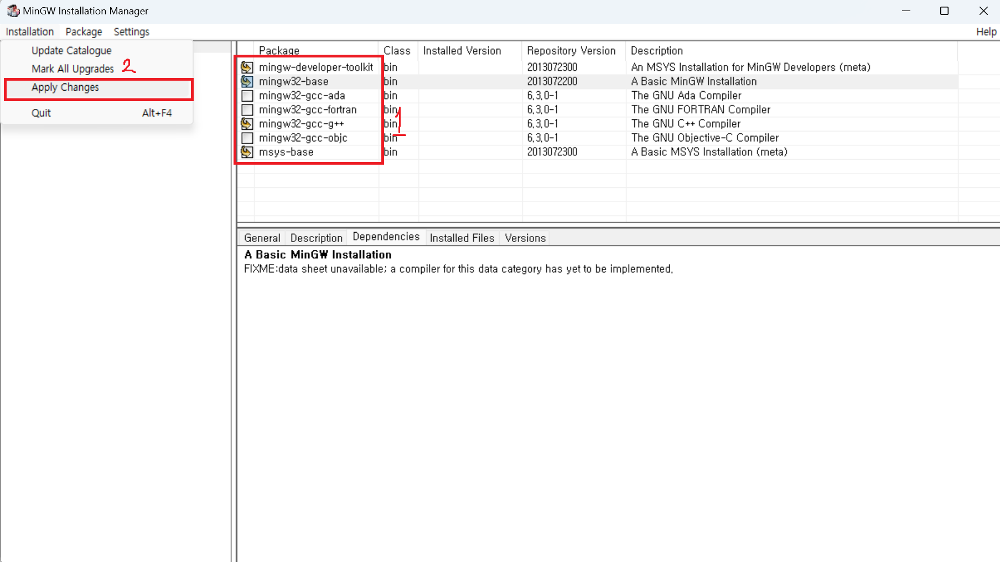

1. `Apply` 버튼을 클릭해 설치합니다.

    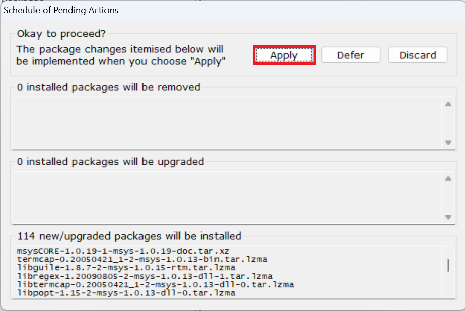

1. `시스템 환경 변수 편집`을 검색해줍니다.

    > [!WARNING]
    >
    > 띄어쓰기에 주의해주세요.

    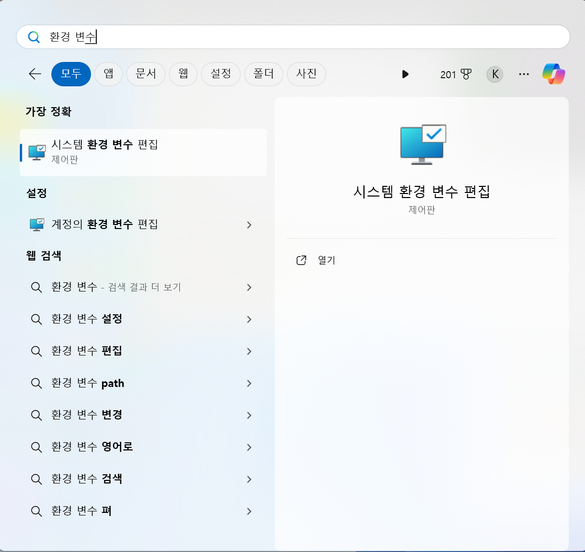

1. `환경 변수(N)...` 버튼을 클릭합니다.

    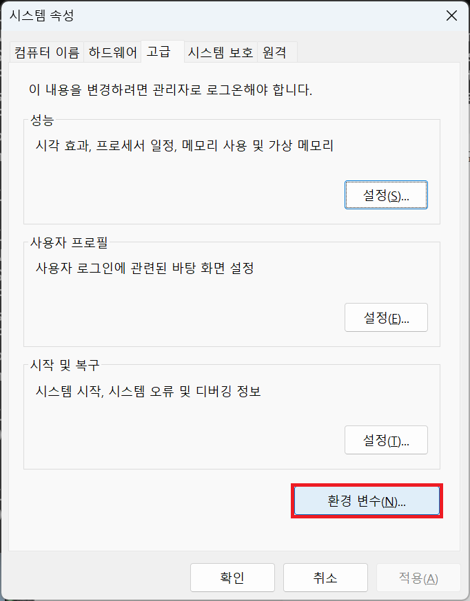

1. 시스템 변수에서 변수 `Path`를 찾아 클릭한 뒤, `편집` 버튼을 클릭합니다.

    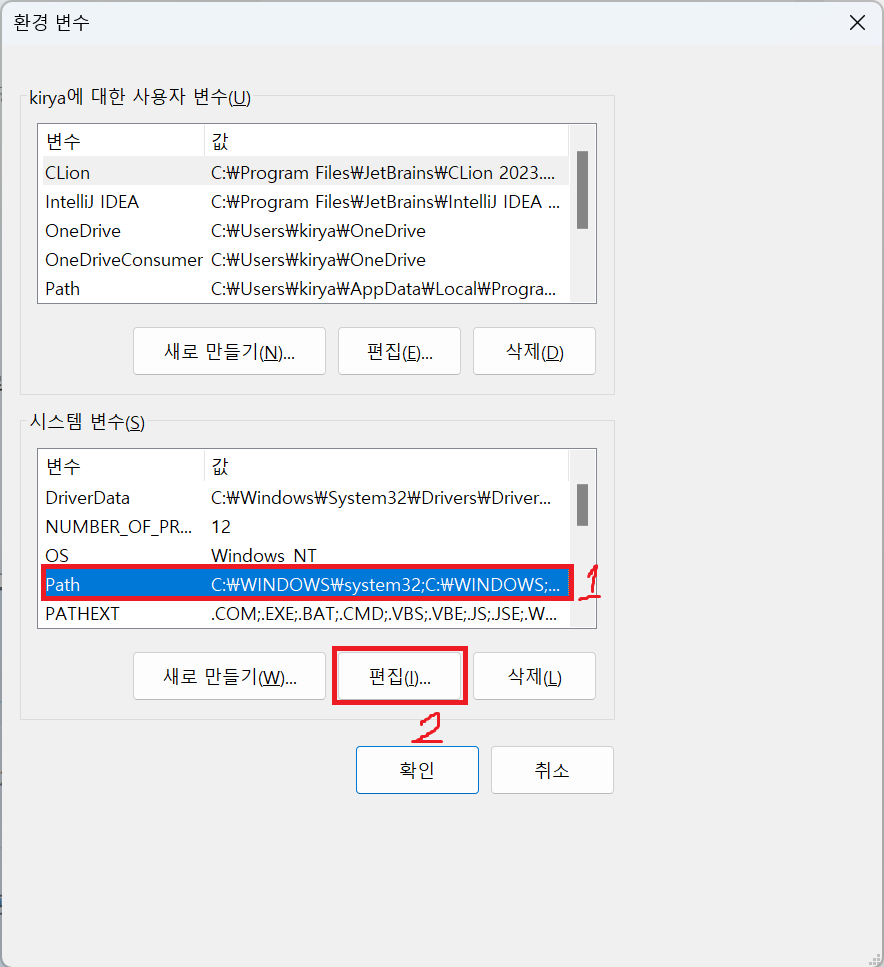

1. `새로 만들기` 버튼을 클릭해 아래 2개의 값을 추가해줍니다.

    ```
    C:\MinGW\bin
    C:\MinGW\msys\1.0\bin
    ```

    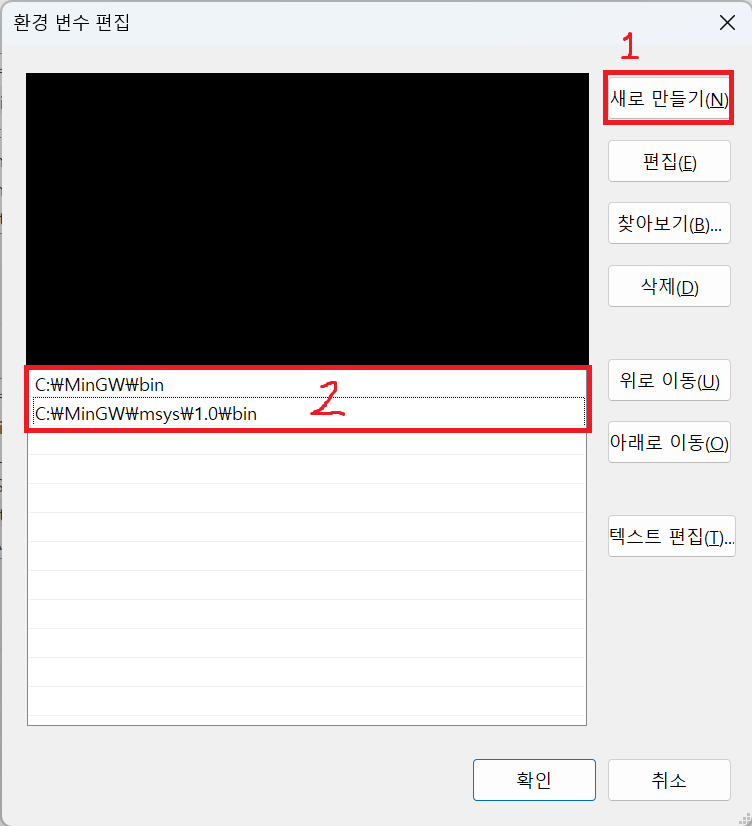

1. 확인을 눌러 저장한 뒤, `git bash`를 열어 아래의 명령어를 입력해봅니다.

    ```bash
    gcc -v
    ```

    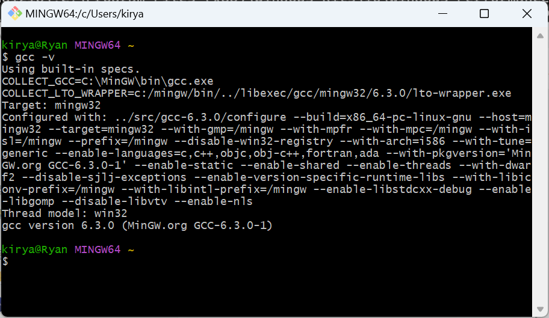

    사진과 비슷하게 뜬다면 성공입니다.

### 🍎 macOS인 경우

1. `Terminal`에 아래의 명령어를 입력합니다.

    ```
    xcode-select --install
    ```

## 1-B. [Python](https://www.python.org/)

1. [Python](https://www.python.org/) 페이지에서 `Downloads` - `Python XXX` 버튼을 클릭합니다.

    > 2024년 2월 27일 기준
    >
    > 현재 최신 버전은 3.12.2 입니다. 버전은 언제든지 바뀔 수 있습니다.

    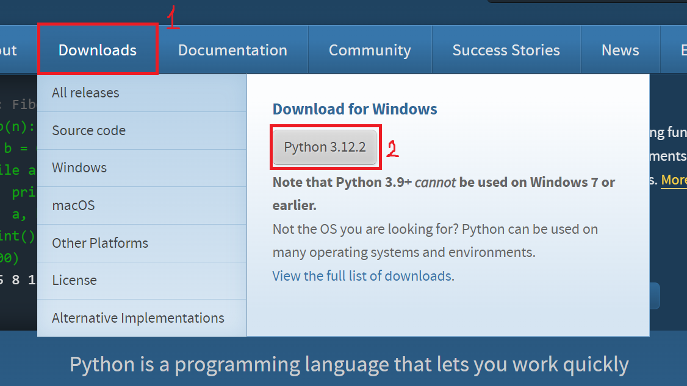

1. `Add python.exe to PATH`를 꼭 체크한 뒤, `Install Now`를 클릭합니다.

    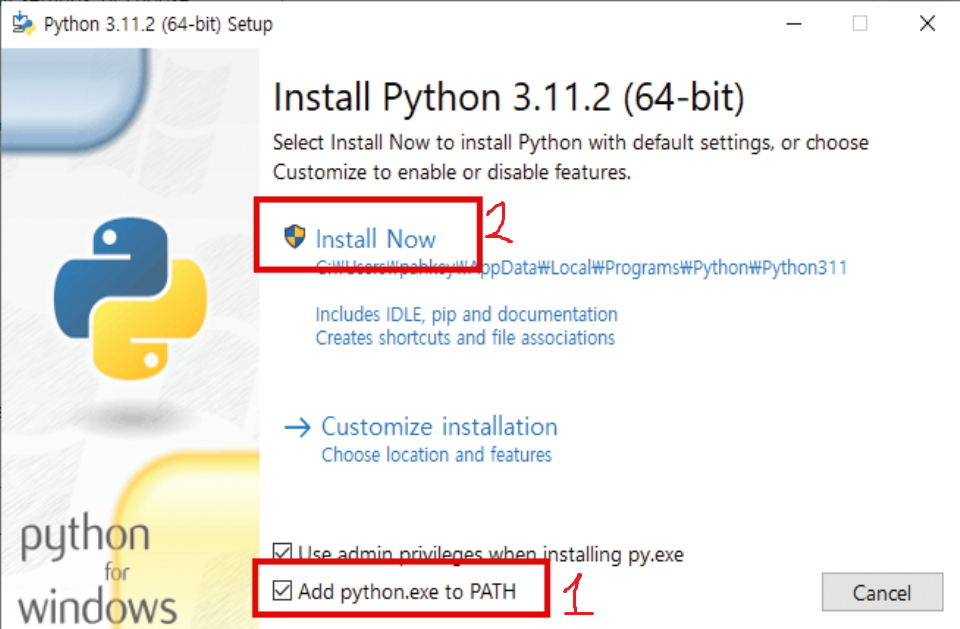

## 2. [Git](https://git-scm.com/)

1. [Git](https://git-scm.com/) 페이지에서 `Download for XXX` 버튼을 클릭합니다.

    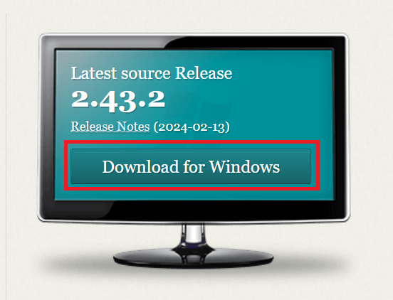

1. 별도 설정없이 설치하면 됩니다.

## 3. [Visual Studio Code](https://code.visualstudio.com/)

내용이 너무 많아 별도의 페이지로 분리하겠습니다. [여기](./2_1_visual_studio_code.md)를 누르면 이동합니다.
