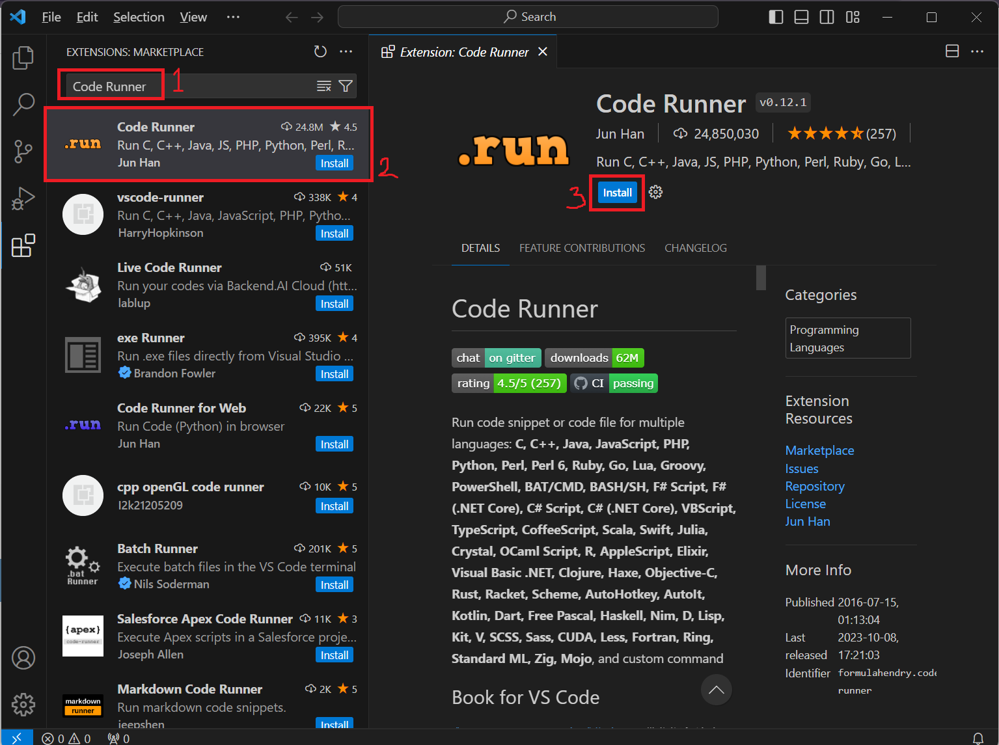
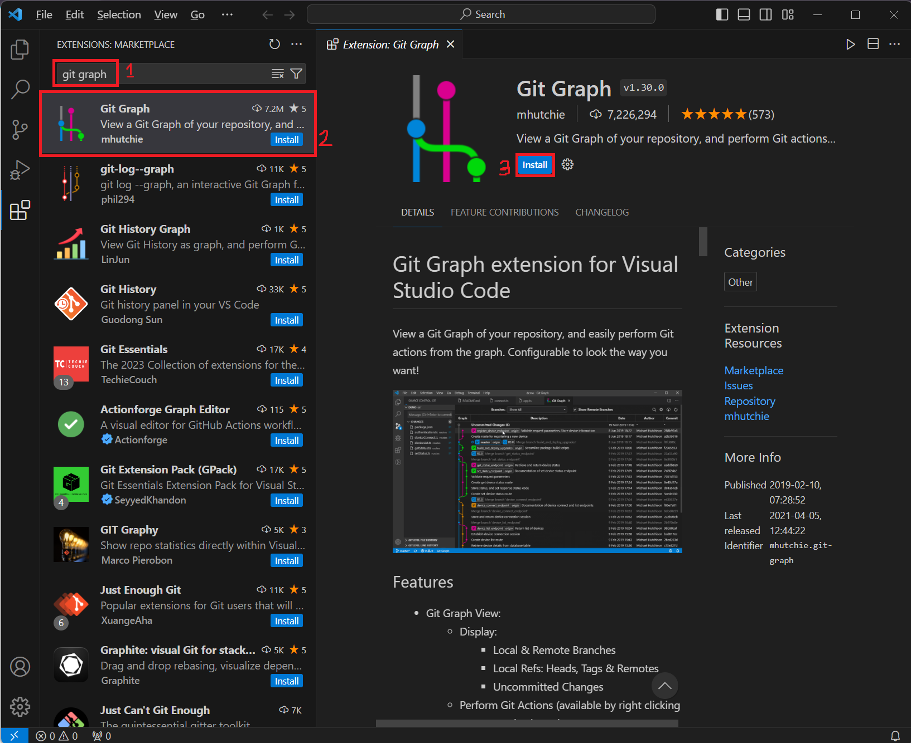
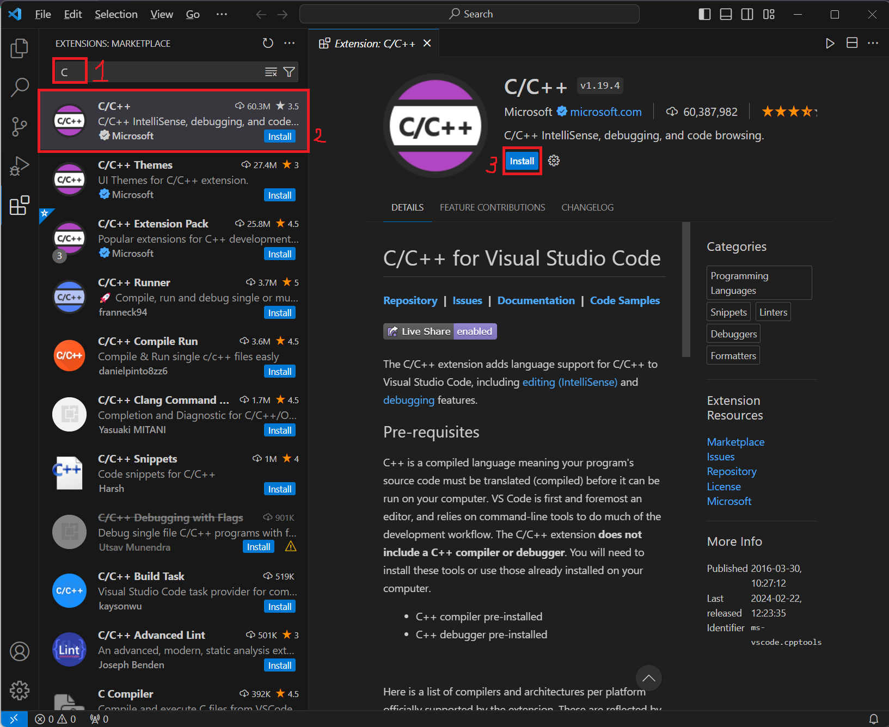
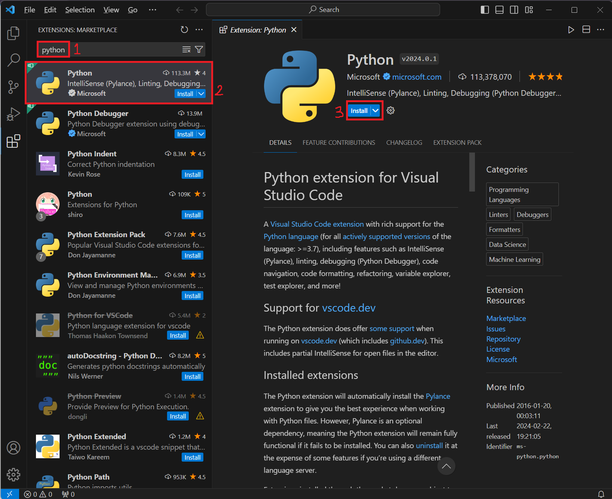
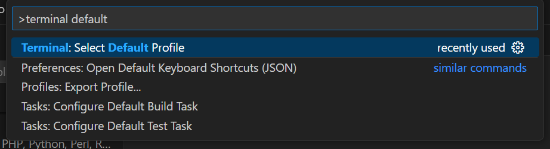
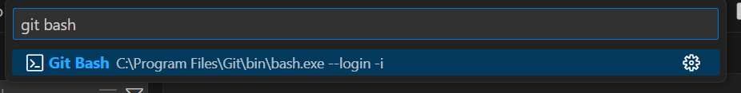
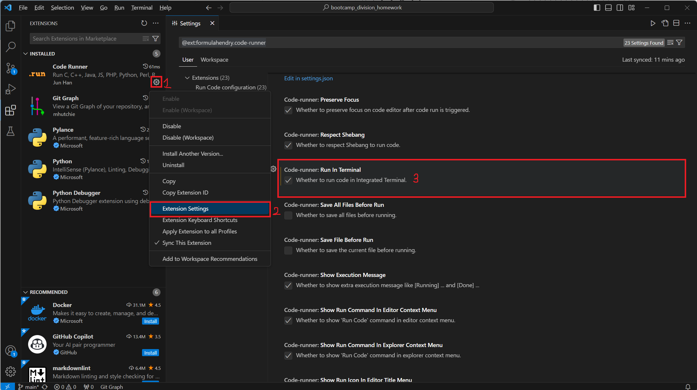
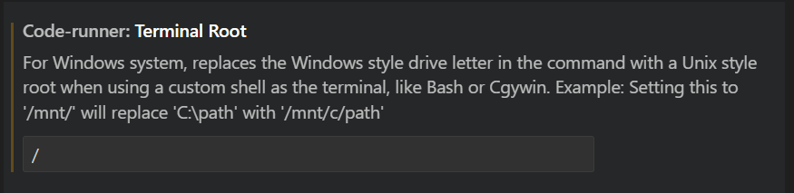

# 해달 0주차 과제 가이드

## 🧱 문제를 풀다가 막혔을 때

문제를 풀다보면 어디서부터 손을 대야할지, 무엇을 모르는 지 몰라서 검색을 못 할 때가 있습니다.

그럴 땐 얼마든지 **동아리방**이나 **디스코드**에서 편하게 질문하세요!

## 1. [Visual Studio Code](https://code.visualstudio.com/) 설치

추후 작성 예정입니다.

## 2. Extension 설치

Extension 이름과 제공자를 확인하고 설치하세요.

| 이름 | 제공자 |
|---|---|
| Code Runner | Jun Han |
| Git Graph | mhutchie |
| C/C++ | Microsoft |
| Python | Microsoft |

### 1. Code Runner

1. `Extension` 탭에서 `Code Runner`를 설치합니다.

    

### 2. Git Graph

1. `Extension` 탭에서 `Git Graph`를 설치합니다.

    

### 3-A. (C 사용자) C/C++

1. `Extension` 탭에서 `C/C++`를 설치합니다.

    

### 3-B. (Python 사용자) Python

1. `Extension` 탭에서 `Python`을 설치합니다.

    

## 3. 기본 Terminal 설정 (git bash)

1. `ctrl + shift + p` 입력한 뒤, `terminal default`를 입력하면 아래와 같이 뜹니다.

    ```
    Terminal: Select Default Profile
    ```

    

1. `git bash`로 설정합니다.

    

## 4. Code Runner 설정

1. `Extension` 탭에서 Code Runner 우측 하단 톱니바퀴를 클릭 - `Extension Settings`을 클릭합니다. 
    
    우측 설정창에서 `Run In Terminal`을 찾아 체크합니다.

    

1. 1번과 마찬가지로 `Terminal Root` 를 찾아 `/`를 입력합니다.

    