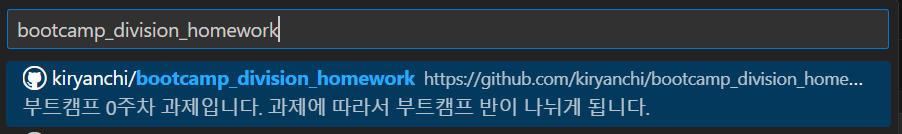
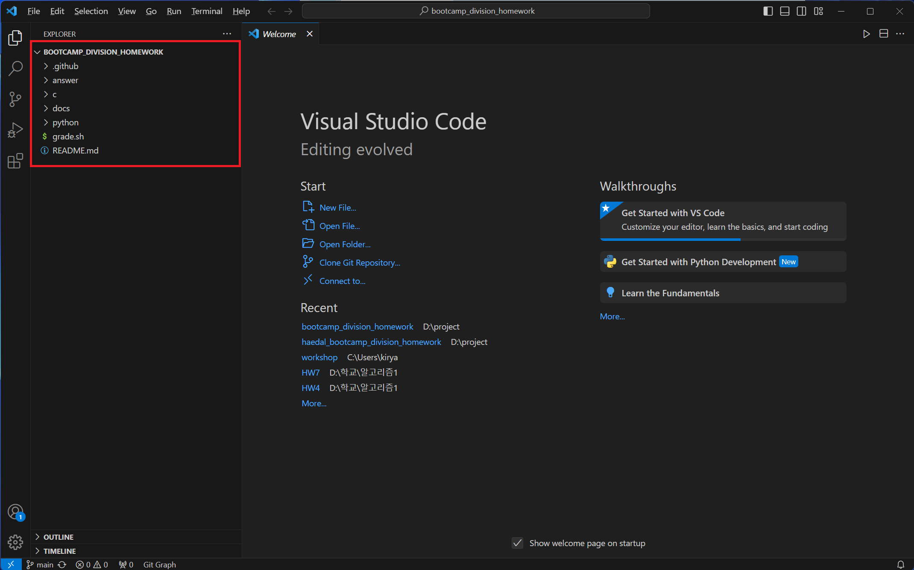

# 해달 0주차 과제 가이드

github에서 fork한 repository를 local로 clone 해보겠습니다.

## 🧱 문제를 풀다가 막혔을 때

문제를 풀다보면 어디서부터 손을 대야할지, 무엇을 모르는 지 몰라서 검색을 못 할 때가 있습니다.

그럴 땐 얼마든지 **동아리방**이나 **디스코드**에서 편하게 질문하세요!

1. VSCode를 열면 `Clone Repository`를 클릭한 뒤 `Clone from GitHub`를 클릭합니다.

    

1. `Allow`를 클릭합니다.

    

1. `Authroize Visual-Studio-Code` 버튼을 클릭합니다.

    

1. fork한 `bootcamp_division_homework` repository를 선택합니다.

    

1. 원하는 경로로 clone합니다.

    

1. `Open` 버튼을 클릭합니다.

    

1. VSCode에 clone한 repository가 열립니다.

    