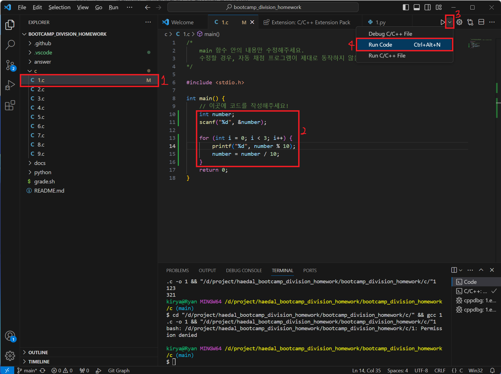
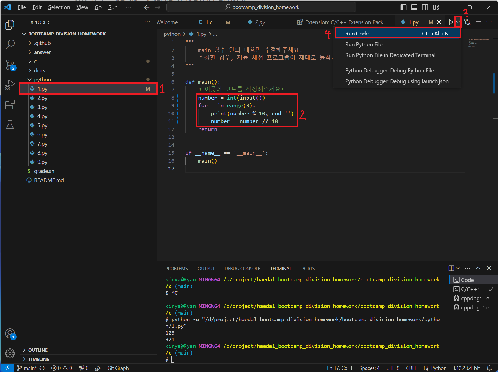
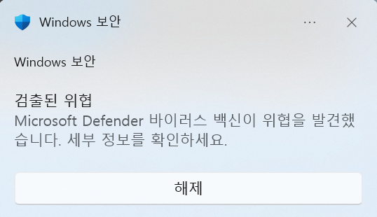
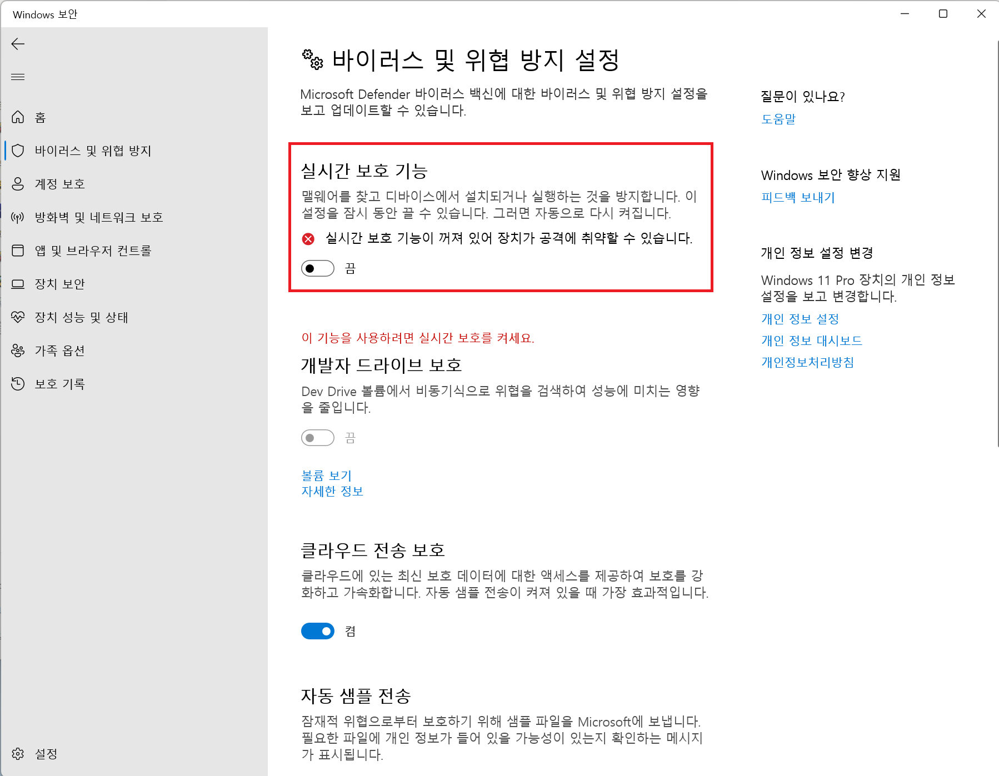

# 해달 0주차 과제 가이드

이제 문제를 풀어볼 차례입니다.

1번 문제를 푼다고 가정해보고 작성해보면 아래와 같이 나옵니다.

## 🧱 문제를 풀다가 막혔을 때

문제를 풀다보면 어디서부터 손을 대야할지, 무엇을 모르는 지 몰라서 검색을 못 할 때가 있습니다.

그럴 땐 얼마든지 **동아리방**이나 **디스코드**에서 편하게 질문하세요!

## [📖 과제 확인](./docs/problems.md)

`C` 혹은 `Python` 둘 중 하나를 선택해 문제를 풀면 됩니다.

## 🚨 주의 사항

> [!WARNING]
>
> 1. 파일 이름을 변경하면 안 됩니다.
> 2. 기존에 생성된 파일 안의 `main` 함수 내용만 작성하시면 됩니다.
> 3. 결과를 출력할 때 오타 및 띄어쓰기, 들여쓰기(엔터)를 주의해주세요.

## 1. C의 경우

1. `c` 폴더 안의 `1.c` 파일을 수정합니다.

1. main 함수의 내용을 수정합니다.

1. Code Runner로 코드를 실행합니다.

    

만약 에러가 뜨면서 코드 실행이 안 된다면 백신 문제일 수 있습니다. [여기](#만약-permission-denied-등의-에러가-뜬다면)를 눌러 해결법을 확인하세요.

## 2. Python의 경우

1. `python` 폴더 안의 `1.py` 파일을 수정합니다.

1. main 함수의 내용을 수정합니다.

1. Code Runner로 코드를 실행합니다.

    

## 만약, Permission denied 등의 에러가 뜬다면?

우측 하단에 보안 경고가 뜰 가능성이 높습니다. scanf등의 함수를 사용하게 되면 Windows에서 보안 이슈로 바이러스로 오진할 수 있습니다.

`실시간 보호 기능`을 잠깐 꺼두고 문제를 풉니다.

> [!WARNING]
>
> 보호 기능을 끈 채로 생활하는 것은 매우 위험하니 끝나면 꼭 보호 기능을 켜기 바랍니다.