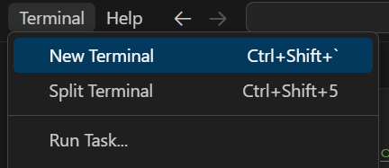
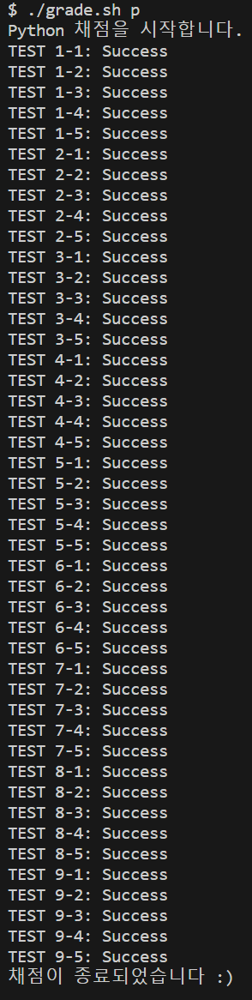

# 해달 0주차 과제 가이드

문제를 풀었다면 채점을 해볼 차례입니다.

## 🧱 문제를 풀다가 막혔을 때

문제를 풀다보면 어디서부터 손을 대야할지, 무엇을 모르는 지 몰라서 검색을 못 할 때가 있습니다.

그럴 땐 얼마든지 **동아리방**이나 **디스코드**에서 편하게 질문하세요!

## 1. C의 경우

1. 상단 메뉴바에서 `Terminal` - `New Terminal`을 클릭합니다.

    

1. `git bash`에 아래 명령어를 입력합니다.

    ```bash
    ./grade.sh c
    ```

## 2. Python의 경우

1. 상단 메뉴바에서 `Terminal` - `New Terminal`을 클릭합니다.

    

1. `git bash`에 아래 명령어를 입력합니다.

    ```bash
    ./grade.sh p
    ```

## 예시

정상적으로 통과된다면 아래와 같이 출력됩니다.



