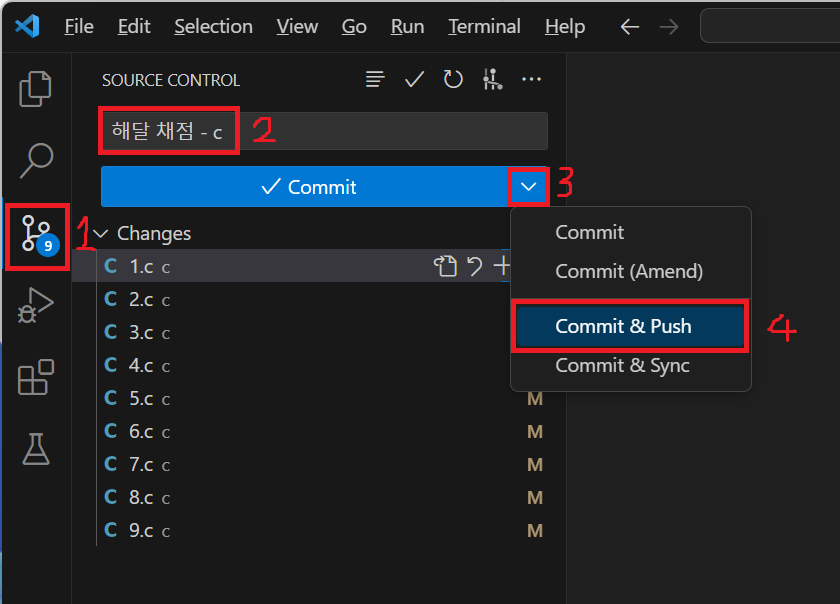
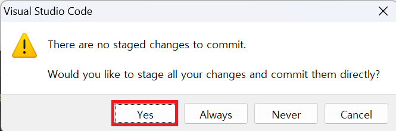
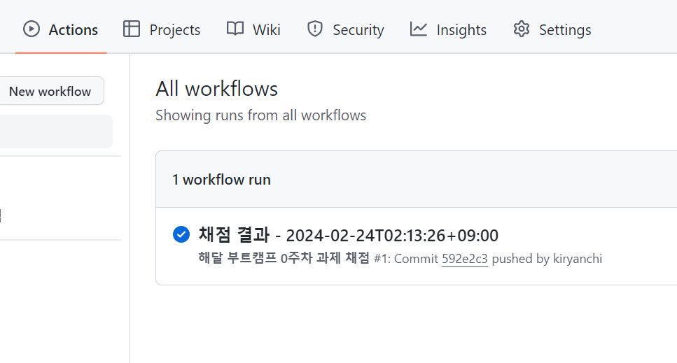
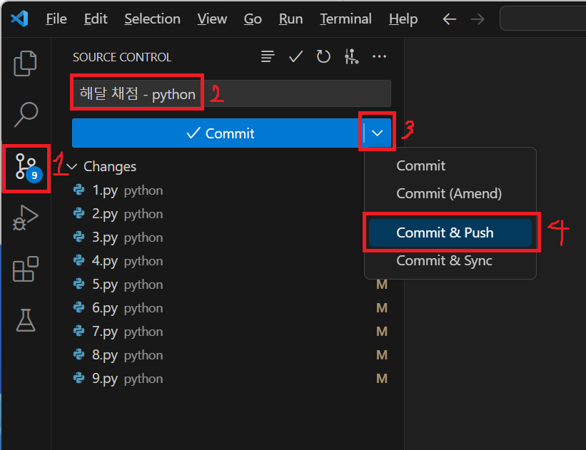

# 해달 0주차 과제 가이드

채점까지 끝났다면 과제를 제출해봅시다.

## 1. C의 경우

1. `git graph` 탭을 클릭합니다.
1. commit message에 아래처럼 입력합니다.
    ```
    # C 문자를 꼭 포함해야합니다!
    해달 채점 - c
    ```
1. 아래 화살표 버튼을 클릭한 뒤, `Commit & Push` 버튼을 클릭합니다.

    

1. `Yes`를 클릭합니다.

    

1. Github repository에 접속한 뒤, `Actions` 탭을 클릭합니다.
    
    아래와 같이 채점이 진행되며 모든 문제를 풀었을 경우 **체크표시**가 됩니다.

    

## 2. Python의 경우

1. `git graph` 탭을 클릭합니다.
1. commit message에 아래처럼 입력합니다.
    ```
    # python 문자열을 꼭 포함해야합니다!
    해달 채점 - python
    ```
1. 아래 화살표 버튼을 클릭한 뒤, `Commit & Push` 버튼을 클릭합니다.

    

1. `Yes`를 클릭합니다.

    

1. Github repository에 접속한 뒤, `Actions` 탭을 클릭합니다.
    
    아래와 같이 채점이 진행되며 모든 문제를 풀었을 경우 **체크표시**가 됩니다.

    